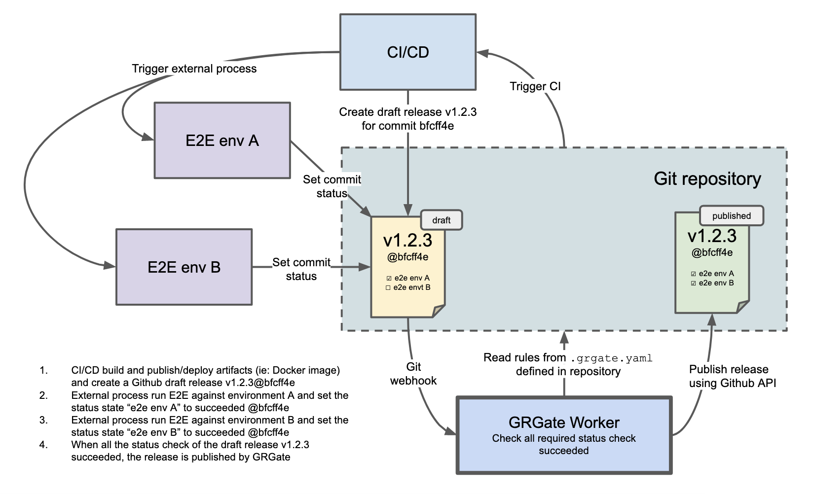

GRGate - Git release gate
=========================

> **grgate**, is git release gate utility which autopublish draft/unpublished
releases based on commit status (aka checks). It can be triggered automatically
using Git webhook or directly from the CLI.

Currently, only Github and Gitlab are supported, other provider could come in a
near future.

## Overview

GRGate is a CLI which can run a server and listen to Git webhook. When a release
is published as draft, GRGate will wait for all the status check attached to the
commit target of the release to succeed before merging it.

The following diagram represent a concret example where a CI/CD process
generate/publish versionned artifacts and generate a draft release. Artifacts
are then deployed by a third party to different environments running with
different config. End-to-end tests are then run against these 2 environments
and reports result to the draft release as commit status. When all tests pass,
GRGate publish the Github release.



### Unpublished releases terminology

Different terminology is used by different provider:

- **Github** uses the term [draft releases][0] to prepare a release without
publishing it.
- **Gitlab** uses the term [upcoming releases][1], it is similar to Github
Pre-releases where a badge notify the upcoming release in the Gitlab release
page.  The attribute `released_at` should be set to a future date to have it
enabled and it is only possible to change it using the Gitlab API.

[0]: https://docs.github.com/en/github/administering-a-repository/managing-releases-in-a-repository#about-release-management
[1]: https://docs.gitlab.com/ee/api/releases/#upcoming-releases

## Getting started

Download latest release from the [release page][2].

[2]: https://github.com/fikaworks/grgate/releases

```bash
# check available commands
$ grgate --help

# run GRGate against the Github repository FikaWorks/grgate:
$ grgate run FikaWorks/grgate

# listen to Git webhook events on 0.0.0.0:8080
$ grgate serve -c config.yaml

# list status for a given commit in the FikaWorks/grgate repository
$ grgate status list FikaWorks/grgate \
    --commit 93431f42d5a5abc2bb6703fc723b162a9d2f20c3

# set status of given commit (Github)
$ grgate status set FikaWorks/grgate \
    --commit 93431f42d5a5abc2bb6703fc723b162a9d2f20c3 \
    --name e2e-happyflow \
    --status completed \
    --state success
```

## Config reference

GRGate has 2 types of configuration:
- **main config** which define global, server settings and credentials to talk
to external API like Github
- **repo config** which is a file stored in the repository and define the
merging rule. Fields are inherited from `main.globals:`, so if you need to
override a setting you can define it in the repository itself

### Main config

The main configuration file can be passed to the CLI via the `--config`
argument, by default it will try to read from `/etc/grgate/config.yaml`.

```yaml
# global configuration, this is the default
globals:
  # filter release by tag, the tag associated to the draft/unpublished releases
  # must match the regular expression defined by tagRegexp, default: .*
  tagRegexp: .*

  # list of statuses, default: []
  statuses:
    - e2e happy flow

# server configuration (webhook)
# webhook should be sent to /<provider>/webhook, where provider is either
# github or gitlab
server:
  listenAddress: 0.0.0.0:8080
  metricsAddress: 0.0.0.0:9101
  probeAddress: 0.0.0.0:8086
  webhookSecret: a-random-string

# number of workers to run, default: 1
workers: 1

# platform to use
platform: github # github|gitlab, default: github

# Github configuration
# when creating the Github app, make sure to set the following permissions:
#   - Administration read/write
#   - Checks read/write
#   - Contents read/write
#   - Metadata read-only
#   - Commit statuses read/write
#
# subscribe to the following webhook events:
#   - Check runs
#   - Check suites
#   - Releases
#   - Statuses
github:
  appID: 000000
  installationID: 00000000
  privateKeyPath: path-to-key.pem

# Gitlab configuration
# when creating the Gitlab token, make sure to set the following permissions:
#   - read_repository
# subscribe to the following webhook events:
#   - Release events
#   - Pipeline events
gitlab:
  token: gitlab-token

# configuration can be overriden in the repository itself, you can define the
# default path below, default: .grgate.yaml
repoConfigPath: .grgate.yaml

logLevel: info  # trace|debug|info|warn|error|fatal|panic, default: info
logFormat: json # json|pretty, default: pretty
```

### Repository config

The `globals:` section of the GRGate configuration can be overriden from the
repository itself. If you create a file named `.grgate.yaml` at the root of the
repository, GRGate will read it before processing the repository.

```yaml
# only process releases with tag matching a regular expression pattern
tagRegexp: v1.0.0-beta-\d*

# automerge release if the following status succeeded
statuses:
  - e2e-with-feature-A-on
  - e2e-with-feature-B-on
```

## Development

For local development, you can use [ngrok](https://ngrok.com/) to receive
Github webhook events.

Start ngrok and forward requests to port `8080`:

```bash
$ ngrok http 8080
```

Create a new webhook from the Github organization or repository settings page.

Use the following settings:
- set the payload URL to your ngrok endpoint, ie:
  `http://bae0d008e18b.ngrok.io/github/webhook`
- content type: `application/json`
- select individual events:
  - Check runs
  - Check suites
  - Releases
  - Statuses

Run the server locally:
```bash
$ go run main.go serve
```

If you create/update a status check or create a draft release, you should see
GRGate processing the triggering repository.

### Build binary

```bash
$ make build
$ ./grgate --help
```

### Docker

```bash
$ make build-docker
$ docker run --ti -p 8080:8080 fikaworks/grgate
```

### Lint

[golangci-lint](https://golangci-lint.run) is used to lint the project, make
sure to have the binary installed on your machine.

```bash
$ make lint
```

You can let `golangci-lint` automatically fix linting issue using the following
command:

```bash
$ golangci-lint run --fix
```

### Tests

Run unit tests:

```bash
$ make test
```

[gomock](https://github.com/golang/mock) mocking framework is used to generate
mocks, you can regenerate all mocks by using the following command:

```bash
$ make mocks
```

### Integration tests

Run integration tests against all platforms. The tests create temporary
repositories and run a series of tests against them.

```bash
$ export GITLAB_OWNER=<gitlab repository owner>
$ export GITLAB_TOKEN=<gitlab api token>
$ export GITHUB_OWNER=<github repository owner>
$ export GITHUB_PRIVATE_KEY_PATH=<github private key path>
$ export GITHUB_APP_ID=<github app id>
$ export GITHUB_INSTALLATION_ID=<github installation id>
$ make integration
```

## Release

[GoReleaser](https://goreleaser.com/) is used to generate all the necessary
binaries and attach them together with the changelog to the Github release. To
release, create a tag then wait for Github Actions to publish the release.
